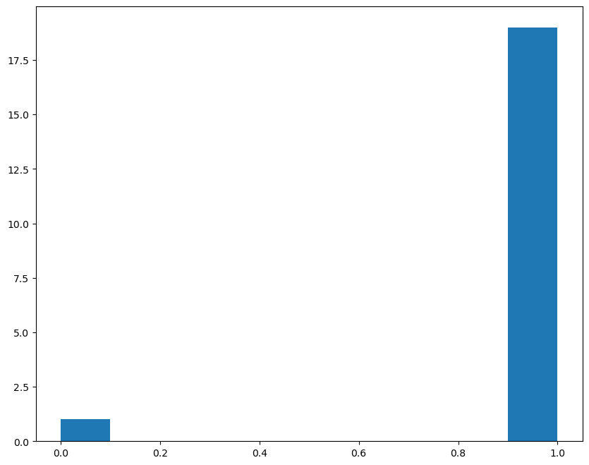
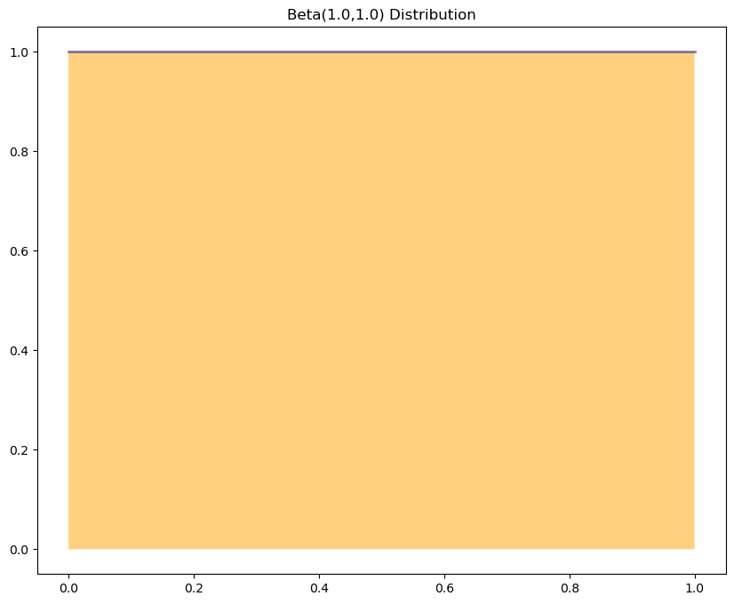
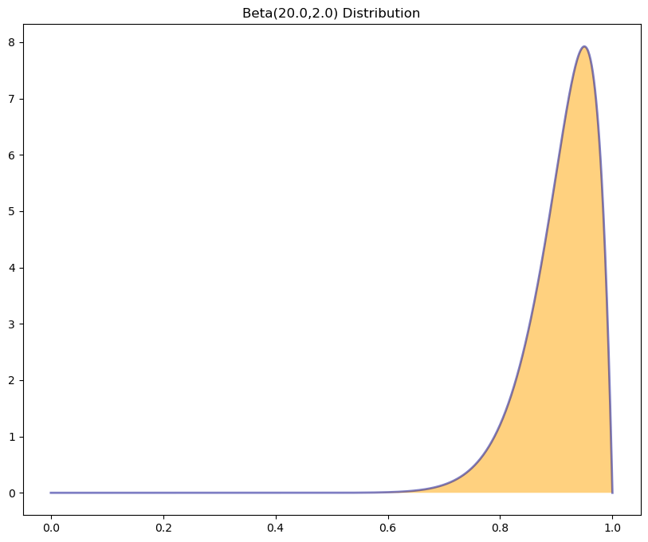
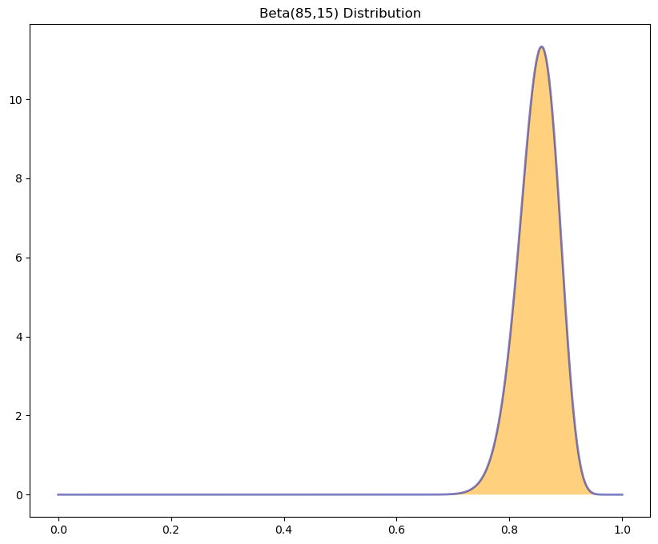
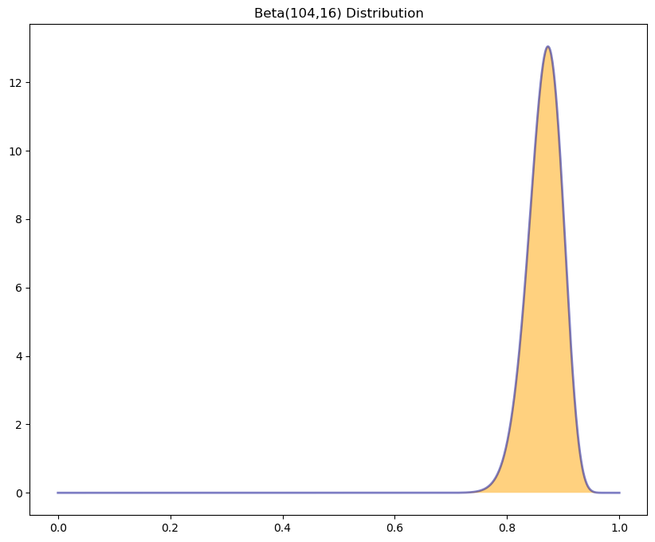

```python
import numpy as np
from scipy import stats
from scipy.optimize import minimize
import matplotlib.pyplot as plt
```


```python
plt.rcParams['figure.figsize'] = [10, 8]
```


```python
np.random.seed(123456789)
θ = 0.85
m = 20
D = np.random.binomial(1, θ, m)
```

### __MLE__


```python
θ_mle = np.mean(D)
```


```python
θ_mle
```


    0.95


```python
plt.hist(D);
plt.show()
```


    

    


### __MAP with a Flat Prior__


```python
def plot_beta(a=1, b=1):
    x = np.linspace(0, 1, 1_000)
    y = stats.beta.pdf(x, a, b)
    plt.plot(x, y, lw=2.0, color='darkblue', alpha=0.5)
    plt.fill_between(x, y, facecolor='orange', alpha=0.5)
    plt.title(f"Beta({a},{b}) Distribution")
    plt.show()
```


```python
## Use a "flat" (uninformative) prior
a_prior = 1.0
b_prior = 1.0
plot_beta(a_prior, b_prior)
```


    

    


```python
## Conjugate model will be Beta(a*, b*) via Bayes' Rule
N1 = np.sum(D)
N0 = m - N1
a_post = a_prior + N1
b_post = b_prior + N0
a_post, b_post
```


    (20.0, 2.0)


```python
plot_beta(a_post, b_post)
```


    

    


```python
θ_map = (a_post - 1.0) / (a_post + b_post - 2.0)
θ_map
```


    0.95


### __Map with an Informative Prior__


```python
α = 85
β = 15
```


```python
plot_beta(α, β)
```


    

    


```python
α_post = α + N1
β_post = β + N0
```


```python
plot_beta(α_post, β_post)
```


    

    


```python
θ_map_inf = (α_post - 1.0) / (α_post + β_post - 2.0)
θ_map_inf
```


    0.8728813559322034


