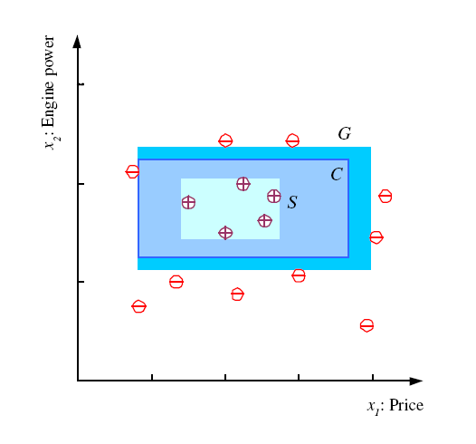

## Learning a Class from Examples

* Class $C$ of a _"family car"
   - **Prediction:** Is a car $x$ a family car?
   - **Knowledge extraction:** What do people expect from a family car? 

* Output:
   - Positive ($+$) and negative ($-$) examples 

* Input representation:
   - $x_{1}:$ price, $x_{2}:$ engine power

## Training set $\mathcal{X}$

$$
\mathcal{X} = \{\mathbf{x}^{t}, r^{t}\}_{t=1}^{N}
$$

\vspace{5mm}

$$
r = \begin{cases}
     1, & \text{if } \mathbf{x} \text{ is positive} \\
     0, & \text{if } \mathbf{x} \text{ is negative}
    \end{cases} 
$$

\vspace{5mm}

$$
\begin{aligned}
 \mathbf{x} &= \begin{bmatrix}
                x_{1} \\
                x_{2} \\
               \end{bmatrix}
\end{aligned}
$$ 

## Training set $\mathcal{X}$

## Class C 

## Hypothesis class $\mathcal{H}$

$$
h(\mathbf{x}) = \begin{cases}
     1, & \text{if } h \text{ says } \mathbf{x} \text{ is positive} \\
     0, & \text{if } h \text{ says } \mathbf{x} \text{ is negative}
    \end{cases} 
$$

\vspace{10mm}

$$
E(h | \mathcal{X}) = \sum\limits_{t=1}^{N} 1(h(\mathbf{x}^{t}) \ne r^{t})
$$

## Hypothesis class $\mathcal{H}$

## S, G, and the Version Space

## Margin

## VC Dimension

* $N$ points can be labeled in $2^{N}$ ways as $+/-$

* $\mathcal{H}$ shatters $N$ if there exists $h \in \mathcal{H}$ consistent for any of these: $VC(\mathcal{H}) = N$

## VC Dimention

## Probably Approximately Correct (PAC) Learning

* How many training examples $N$ should we have, such that with $1 - \delta$, $h$ has __error at most__ $\epsilon$? (Blumer et al., 1998)

* Each strip is at most $\epsilon / 4$

* $Pr$ that we miss a strip $1 - \epsilon / 4$ 

* $Pr$ that $N$ instances miss a strip $(1 - \epsilon / 4)^{N}$

* $Pr$ that $N$ instances miss $4$ strips $4 (1 - \epsilon / 4)^{N}$

* $4 (1 - \epsilon / 4)^{N} \le \delta$ and $(1 - x) \le \exp{(-x)}$

* $4 \exp{(-\epsilon N / 4)} \le \delta$ and $N \ge (4/3) \log{(4/\delta)}$

## PAC Learning

